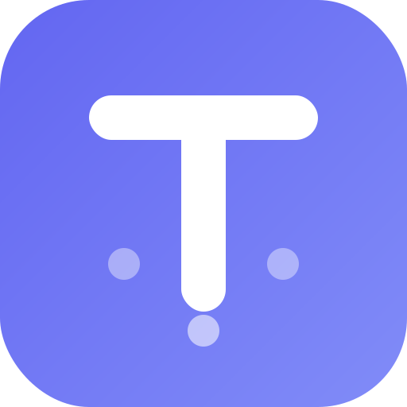
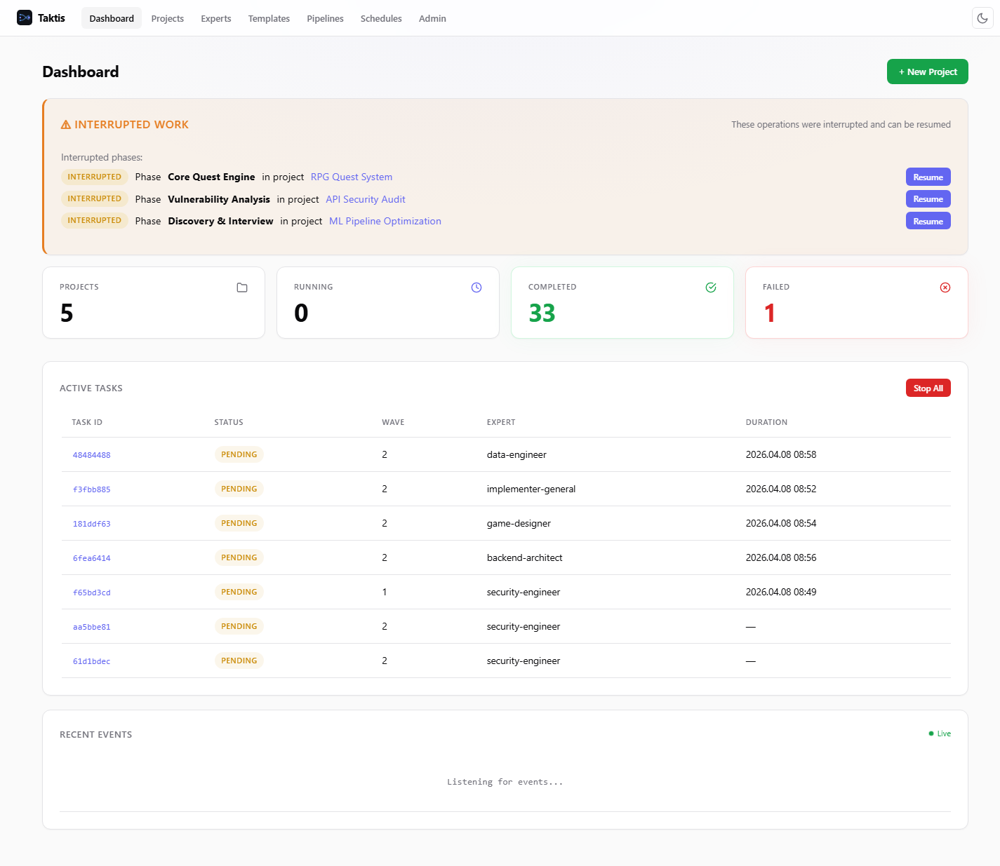
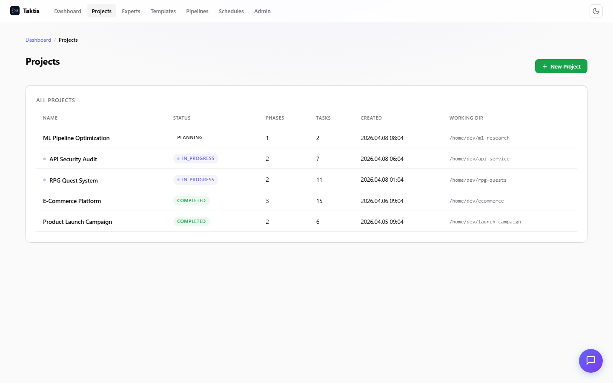
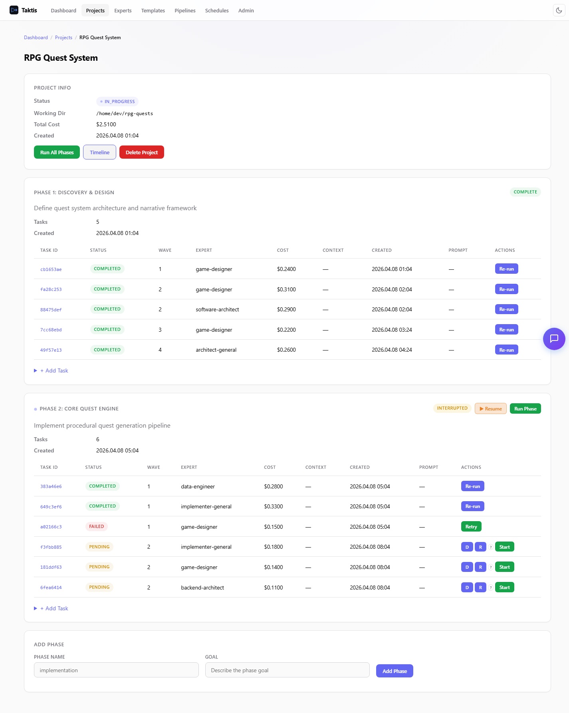
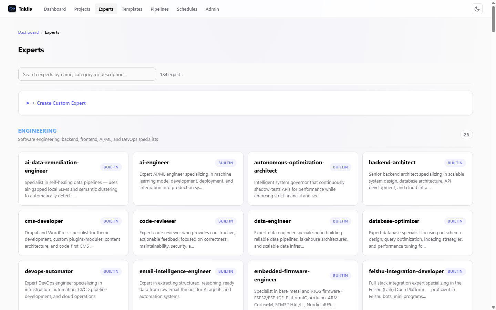
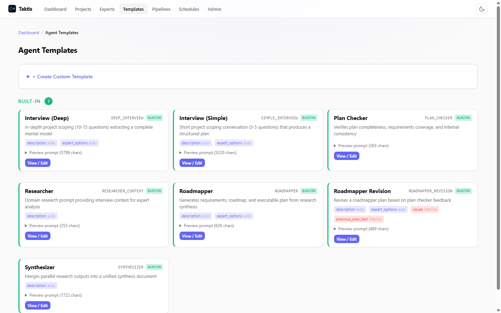
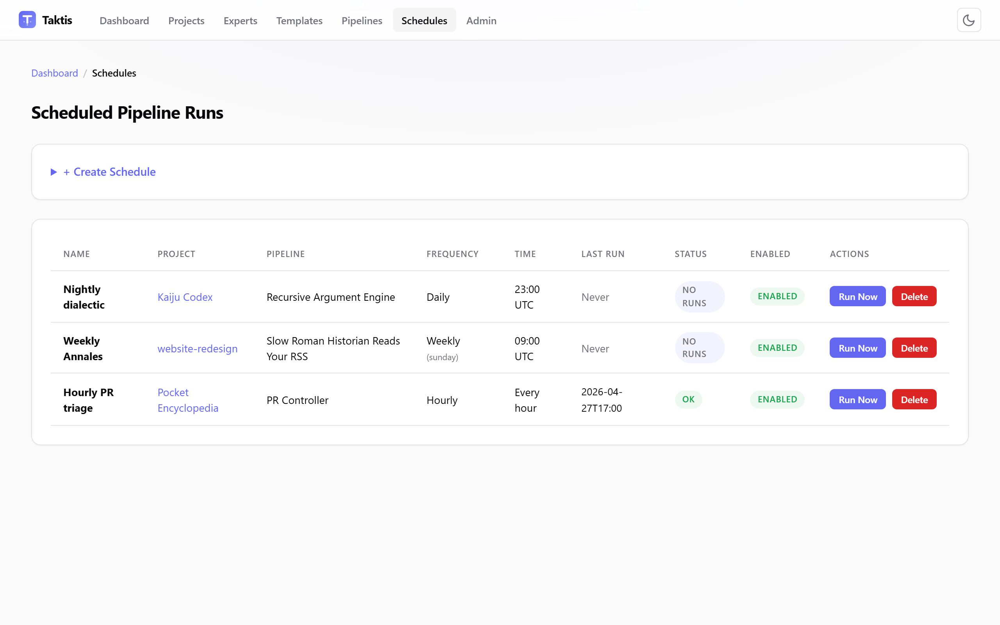

<p align="center">
  
</p>

<h1 align="center">taktis</h1>

<p align="center">
  <a href="LICENSE"></a>
  <a href="https://python.org"></a>
  <a href="https://docs.claude.com/en/api/agent-sdk/overview"></a>
</p>

<p align="center">
  <strong>A self-hosted visual orchestrator for the Claude Agent SDK — drag-and-drop DAG editor, up to 15 parallel specialist agents, review loops, and human-approval gates.</strong>
</p>

<p align="center">
  <video src="https://github.com/user-attachments/assets/9db10935-3894-4d92-b27c-0c62ef6ed7da"
         poster="docs/demo-poster.png"
         controls muted playsinline width="900">
    <a href="https://github.com/user-attachments/assets/9db10935-3894-4d92-b27c-0c62ef6ed7da">Watch the 30-second demo</a> — pipeline designer, node configuration, dashboard, scheduler.
  </video>
</p>

Built for developers, researchers, and analysts running multi-stage work with Claude Code who want parallel agents, review cycles, and crash-resumable pipelines without writing the scaffolding themselves. **taktis** is the layer on top of the [Claude Agent SDK](https://docs.claude.com/en/api/agent-sdk/overview) that handles wave-parallel execution, persona assignment, cross-task context, and phase review — all driven from a browser UI.

The distinctive part: **pipelines can spawn pipelines.** An agent analyzes a situation, writes a structured plan, and an Apply Plan node turns that plan into new phases and tasks. Workflows that decide their own next step, recursively.

## Try it in 60 seconds

```bash
git clone https://github.com/b0untyhunt3r/taktis.git && cd taktis
docker compose up -d                           # build + start
docker compose exec taktis claude login        # one-time, inside the container
# open http://localhost:8080
```

Auth lives in a Docker volume (`claude-auth`), not your host — fully container-local, survives restarts, no `~/.claude` bind-mount and no platform-specific paths. Headless? Set `ANTHROPIC_API_KEY` in `.env` and skip the login step.

Prefer a native install? Pick your platform:

| Platform | One-liner |
|---|---|
| Windows | `scripts\setup-windows.bat` → `python run.py` |
| macOS | `./scripts/setup-macos.sh` → `python3 run.py` |
| Linux | `./scripts/setup-linux.sh` → `python3 run.py` |

Each setup script installs Python, Node.js, the Claude Code CLI, and **taktis**'s dependencies. See [Install](#install) for manual steps.

## What **taktis** adds to Claude Code

On its own, Claude Code runs one agent at a time, in your terminal. **taktis** lets you run many of them — coordinated, reviewed, and recoverable — from a browser.

| Without **taktis** | With **taktis** |
|---|---|
| One agent at a time | Up to 15 specialists working at once |
| Agents can't share their work | Results flow automatically from one step to the next |
| A crash means starting over from the top | Picks up exactly where it left off |
| You wire every step together by hand | Drag-and-drop the workflow together in your browser |
| You write every prompt from scratch | 184 ready-made experts to assign in one click |
| Whatever the agent produces is final | A second agent reviews the work and asks for fixes |
| You watch it run in a terminal | See every agent typing live in a web UI |
| You re-run it manually each time | Schedule it to run nightly, weekly, or monthly |
| The agent decides everything alone | Pause mid-run for your approval when it matters |
| Workflows are fixed up front | Agents can plan and add new steps on the fly |

If you just want one agent doing one thing, plain Claude Code is fine. **taktis** pays off the moment you want several agents working together.

## Core capabilities

- **Visual pipeline designer** — drag-and-drop DAG editor with 14 node types, not YAML. Simple chains or complex branching DAGs with loops, fan-outs, and LLM routers — all editable in-browser.
- **184 expert personas across 18 categories** — engineering, marketing, game dev, sales, design, academic, spatial computing, and more. Each carries a domain-specific system prompt that shapes how Claude reasons about the task.
- **Self-extending pipelines** — Apply Plan nodes parse structured output and create new phases and tasks in the database. Pipelines that generate pipelines. Recursive decomposition of any problem.
- **Wave-based parallelism** — tasks in the same wave run simultaneously, respecting dependency order across waves. Fan-out nodes split work across parallel agents automatically.
- **Human-in-the-loop everywhere** — human gates pause for approval, interactive tasks accept input mid-run, AskUserQuestion nodes present structured radio-button choices. You stay in control.
- **Automatic review-fix cycles** — loop nodes retry upstream agents until quality conditions pass. Reviewer experts inspect completed phases and auto-spawn fix tasks (up to 3 attempts).
- **Scheduled runs** — wire any pipeline to a cron schedule (hourly, daily at a time, weekly on a day, monthly). **taktis** auto-detects interactive nodes (`human_gate`, interactive agents) and warns before you schedule something that can't run headless.
- **Crash-resilient** — a 30-task pipeline that crashes at task 27 resumes from task 27, not task 1. Wave checkpoints are written after every successful wave.

<details>
<summary><strong>More</strong></summary>

- Live token-by-token streaming via SSE
- Context budgeting with priority levels (P0=must → P4=trim-first), default 150K chars, configurable per project
- Interactive tasks with tool approval UI (auto-approve Read/Glob/Grep, prompt for writes)
- AI-assisted project planning (interview → synthesized research → auto-generated phases/tasks)
- Model profiles (quality / balanced / budget) for cost optimization
- Agent templates with variable substitution and retry logic
- Conditional branching, LLM routers, aggregators, API-call nodes, text transforms
- Multi-phase execution with cross-phase context sharing via manifest
- Built-in meta-pipeline ("Pipeline Factory") that designs and generates new pipelines from a plain-language description

</details>

## Screenshots

<details>
<summary><strong>Dashboard — status cards, active tasks, interrupted work</strong></summary>



</details>

<details>
<summary><strong>Projects — all projects with status, phases, and task counts</strong></summary>



</details>

<details>
<summary><strong>Project detail — phases, tasks, experts, costs</strong></summary>



</details>

<details>
<summary><strong>Expert personas — 184 experts across 18 categories</strong></summary>



</details>

<details>
<summary><strong>Agent templates — reusable prompt templates with variables</strong></summary>



</details>

<details>
<summary><strong>Schedules — cron-driven pipeline runs (hourly / daily / weekly / monthly)</strong></summary>



</details>

## The Pipeline Toolkit

### 14 node types

| Category | Node | What it does |
|----------|------|-------------|
| **Agent** | Agent | Run a Claude task — standard prompt, template with variables, or interactive interview |
| **Control** | Conditional | Route to branches based on upstream output (contains, regex, task_failed, etc.) |
| **Control** | LLM Router | Classify input with a lightweight LLM and route to 2–4 branches |
| **Control** | Fan Out | Split input into items, run the same agent on each in parallel, merge results |
| **Control** | Loop | Retry upstream agent until a quality condition passes (review-fix cycles) |
| **Control** | Human Gate | Pause execution, show results to user, wait for approval |
| **Control** | Phase Settings | Configure phase name, goal, success criteria, cross-phase context |
| **Transform** | Output Parser | Split text into named sections using markers |
| **Transform** | Aggregator | Combine parallel outputs (concat, JSON merge, numbered list, XML wrap) |
| **Transform** | Text Transform | Prepend, append, replace, extract JSON, wrap XML — no LLM call |
| **Action** | Write File | Save results to `.taktis/` with context priority for downstream phases |
| **Action** | Apply Plan | Parse structured JSON output into new database phases and tasks |
| **Action** | API Call | HTTP request to external URLs — webhooks, REST APIs, data enrichment |
| **Meta** | Pipeline Generator | Convert a structured pipeline spec into a new Drawflow template — pipelines that create pipelines |

### 184 expert personas, 18 categories

Experts aren't decorative labels — each is a full system prompt that shapes how Claude reasons about its task. Using a `security-engineer` persona on a marketing brief or a `narratologist` on a codebase audit isn't a mistake; it's a design pattern.

<details>
<summary><strong>All 18 categories</strong></summary>

| Category | Examples |
|----------|----------|
| **Engineering** | software-architect, backend-architect, data-engineer, security-engineer, devops-automator, solidity-smart-contract-engineer |
| **Marketing** | growth-hacker, seo-specialist, content-creator, social-media-strategist, podcast-strategist, tiktok-strategist |
| **Game Dev** | game-designer, narrative-designer, level-designer, unity-architect, unreal-systems-engineer, godot-gameplay-scripter |
| **Sales** | deal-strategist, discovery-coach, outbound-strategist, sales-engineer, pipeline-analyst, account-strategist |
| **Design** | ui-designer, ux-architect, ux-researcher, brand-guardian, image-prompt-engineer, visual-storyteller |
| **Product** | product-manager, sprint-prioritizer, trend-researcher, feedback-synthesizer, behavioral-nudge-engine |
| **Testing** | qa-lead, api-tester, performance-benchmarker, accessibility-auditor, evidence-collector, workflow-optimizer |
| **Academic** | historian, psychologist, geographer, anthropologist, narratologist |
| **Paid Media** | ppc-campaign-strategist, paid-social-strategist, programmatic-display-buyer, paid-media-auditor, search-query-analyst |
| **Project Mgmt** | senior-project-manager, studio-producer, studio-operations, experiment-tracker, project-shepherd |
| **Specialized** | compliance-auditor, civil-engineer, salesforce-architect, blockchain-security-auditor, mcp-builder, recruitment-specialist |
| **Spatial Computing** | visionos-spatial-engineer, xr-immersive-developer, xr-interface-architect, terminal-integration-specialist |
| **Support** | analytics-reporter, infrastructure-maintainer, legal-compliance-checker, finance-tracker, support-responder |
| **Review** | reviewer-general, accessibility-reviewer, security-reviewer-general |
| **Architecture** | architect-general |
| **Implementation** | implementer-general, docs-writer-general, refactorer |
| **DevOps** | devops |
| **Internal** | interviewer, synthesizer, roadmapper, plan-checker, question-asker (pipeline-only, hidden from manual UI) |

</details>

### Design patterns

These compose freely. A single pipeline can use several at once.

- **Parallel Perspectives** — fan out a question to multiple expert personas, then aggregate. A marketing brief reviewed simultaneously by a brand-guardian, a growth-hacker, and a compliance-auditor.
- **Adversarial Loops** — generator produces, critic reviews, loop retries until quality passes. Code → review → fix → re-review.
- **Classify and Route** — LLM router examines input and sends it down the right branch. Customer tickets into billing, technical, or escalation pipelines.
- **Self-Spawning Pipelines** — an agent analyzes a problem, writes a structured plan, Apply Plan creates new phases and tasks. The pipeline extends itself based on what it discovers.
- **Recursive Decomposition** — Apply Plan as a recursive call. A research pipeline discovers sub-questions, spawns a research pipeline for each, synthesizes the results.
- **Persona Arbitrage** — experts used outside their native domain. A game-designer on UX flows. A psychologist on sales scripts. A historian on technical debt.
- **Gated Escalation** — conditionals check severity, human gates pause for high-stakes decisions, loops handle routine fixes automatically. Humans intervene only when it matters.

## Flagships

Four pipelines show what **taktis** is for. All four ship with the repo; the rest are one designer-save away.

### 1. Pipeline Factory — pipelines that design pipelines

The headline meta-pipeline, and the distinctive primitive in **taktis**. Two phases:

1. **Discovery** — a question-asker agent interviews you about your goal. An LLM router classifies the domain. Four domain-specific interactive agents probe deeper. An aggregator synthesizes everything into `DISCOVERY.md`.
2. **Pipeline Design** — an architect (Opus-tier) reads the discovery output and designs a full pipeline specification. A human gate lets you review and approve. The `pipeline_generator` node converts the approved spec into a fully wired Drawflow template, saved to the database, ready to execute.

Describe what you want in plain language; **taktis** designs and builds the pipeline for you. Generated pipelines are first-class — edit them in the visual designer, run them, or fork them as starting points.

> Ships as [`taktis/defaults/pipeline_templates/pipeline-factory.json`](taktis/defaults/pipeline_templates/pipeline-factory.json) — visible in the designer on first launch.

### 2. AI Project Planner — bootstrap a real project

The built-in starter. An interviewer probes the project, researchers fan out to build context across multiple angles, a synthesizer produces structured phases and tasks, and an Apply Plan node writes the plan into the database. This is what most first-time users actually run — the "turn an idea into a scaffolded project" pipeline.

> Ships as [`taktis/defaults/pipeline_templates/planning-pipeline.json`](taktis/defaults/pipeline_templates/planning-pipeline.json).

### 3. PR Controller — a specialist code reviewer for every diff

Schedule it daily. An `api_call` pulls open PRs from GitHub, a `fan_out` parallelises across them, an `llm_router` classifies each diff (data / security / performance / accessibility), and routes to the matching specialist persona — `database-optimizer`, `security-engineer`, `performance-benchmarker`, or `accessibility-auditor`. An `aggregator` rolls findings up, a `file_writer` drops a dated triage report into `pr-triage/`. Headless and cron-safe — no `human_gate`, no interactive nodes, the whole thing finishes before you open your laptop.

> Ships as [`taktis/defaults/pipeline_templates/pr-controller.json`](taktis/defaults/pipeline_templates/pr-controller.json).

### 4. The Slow Roman Historian — Persona Arbitrage in pure form

Schedule it weekly. An `api_call` fetches Hacker News' RSS, a `historian` persona renders the week's tech news as a chapter from Tacitus' *Annales*, in the voice of a 2nd-century Roman who has never heard of computers. A `loop` node retries until fewer than two modern technical terms remain in the prose, then a `file_writer` saves `annales/MMXXVI-week-NN.md`. The point isn't the joke — the point is that the loop's quality predicate is what makes a persona arbitrage actually land. Pure proof that the orchestration primitives compose for things no single prompt does well.

> Ships as [`taktis/defaults/pipeline_templates/slow-roman-historian.json`](taktis/defaults/pipeline_templates/slow-roman-historian.json).

---

These four are the curated set. Another also ships out of the box — **Recursive Argument Engine** ([`taktis/defaults/pipeline_templates/recursive-argument-engine.json`](taktis/defaults/pipeline_templates/recursive-argument-engine.json)) — and 20+ more scheduled-pipeline recipes ready to fork live in [`docs/vault/Recipes.md`](docs/vault/Recipes.md).

---

**Apply Plan turns every pipeline into a potential pipeline factory.** A research pipeline that discovers unexpected complexity can spawn a deeper investigation. A review pipeline that finds critical issues can spawn targeted fix pipelines. The system doesn't just execute predefined workflows — it reasons about what workflows are needed and creates them.

For more composable patterns — fan-out, classify-and-route, recursive decomposition, persona arbitrage — see [Design patterns](#design-patterns) above.

## How it works

```
┌─────────────────────────────────────────────────────────────┐
│                     Web UI (htmx + SSE)                     │
│  Dashboard · Project Detail · Pipeline Designer · Experts   │
└─────────────┬───────────────────────────────┬───────────────┘
              │ HTTP/SSE                      │ SSE streaming
┌─────────────▼───────────────────────────────▼───────────────┐
│                    Starlette ASGI Server                     │
│              ~50 API endpoints · Jinja2 templates            │
└─────────────┬───────────────────────────────┬───────────────┘
              │                               │
┌─────────────▼──────────┐  ┌────────────────▼────────────────┐
│     GraphExecutor      │  │         WaveScheduler           │
│  Drawflow → DAG waves  │  │  Wave-based parallel execution  │
│  14 node types         │  │  Dependency ordering            │
└─────────────┬──────────┘  └────────────────┬────────────────┘
              │                               │
┌─────────────▼───────────────────────────────▼───────────────┐
│                    ProcessManager                            │
│         Semaphore-gated (15 slots) agent pool                │
└─────────────┬───────────────────────────────────────────────┘
              │
┌─────────────▼───────────────────────────────────────────────┐
│                      SDKProcess                              │
│  Claude Agent SDK wrapper · streaming · tool approval        │
│  Interactive (multi-turn) + non-interactive (one-shot)       │
└─────────────┬───────────────────────────────────────────────┘
              │
┌─────────────▼──────────┐  ┌─────────────────────────────────┐
│   Claude Agent SDK     │  │         aiosqlite DB             │
│   184 expert personas  │  │  Projects · Phases · Tasks       │
│   Agent templates      │  │  Pipeline templates · Experts    │
└────────────────────────┘  │  Crash recovery checkpoints      │
                            └─────────────────────────────────┘
```

**Execution flow:** you create a project and select a pipeline template. `GraphExecutor` parses the Drawflow JSON into a DAG, groups nodes into waves (topologically sorted), and creates DB phases and tasks. `WaveScheduler` runs each wave — tasks within a wave in parallel, waves sequentially. Each task runs inside an `SDKProcess` that streams output token-by-token via SSE to the browser. `.taktis/` files let agents share results across tasks and phases.

For module-by-module detail, start at [`docs/vault/Home.md`](docs/vault/Home.md) — the full architecture docs live as an Obsidian vault under `docs/vault/`.

## Install

### Docker (fastest)

```bash
docker compose up -d                           # build + start in background
docker compose exec taktis claude login        # one-time OAuth, inside the container
# open http://localhost:8080
```

The compose file uses three volumes:

- `taktis-data` — named volume at `/app/data`, persists the SQLite DB across restarts.
- `claude-auth` — named volume at `/root/.claude`, persists your in-container Claude Code OAuth state. Fully decoupled from the host; works the same on Linux, macOS, Windows, and WSL.
- `./projects` → `/projects` — default working-directory root for projects you create. Override with `PROJECTS_DIR=/path/to/somewhere docker compose up`.

**Authentication options (pick one):**

1. **OAuth inside the container (default)** — `docker compose exec taktis claude login`. If the CLI's browser callback flow doesn't cleanly reach your host browser, use option 2 or 3.
2. **API key (headless)** — set `ANTHROPIC_API_KEY=sk-ant-...` in `.env`. Fastest, works in CI, no browser step. Pay-per-token on your API credits.
3. **Reuse host login (Claude Max/Pro subscription users)** — uncomment the `$HOME/.claude` bind-mount line in `docker-compose.yml` and comment out `claude-auth:/root/.claude`. Shares your host's subscription-linked session.

### Setup script (beginners)

| Platform | Command |
|----------|---------|
| **Windows** | `scripts\setup-windows.bat` then `python run.py` |
| **macOS** | `./scripts/setup-macos.sh` then `python3 run.py` |
| **Linux** | `./scripts/setup-linux.sh` then `python3 run.py` |

The script installs Python, Node.js, the Claude Code CLI, creates a venv, and installs dependencies.

### Manual install

Prerequisites: Python 3.10+, Node.js 18+ (for the CLI), and the [Claude Code CLI](https://docs.claude.com/en/docs/claude-code).

```bash
npm install -g @anthropic-ai/claude-code
pip install -r requirements.txt
claude login
python3 run.py
```

### Authentication

**taktis** delegates auth to Claude Code:

- **OAuth (recommended)**: `claude login` — one-time interactive setup.
- **API key (headless/Docker)**: set `ANTHROPIC_API_KEY` env var.

### Configuration

All settings are optional. Configure via environment variables prefixed with `TAKTIS_`. See [`.env.example`](.env.example) for the full list.

## Non-goals

What **taktis** deliberately doesn't try to be:

- **A model-agnostic framework.** It's Claude-Agent-SDK-specific. If you need to swap providers, LangChain/CrewAI will serve you better.
- **A production RAG system.** Context sharing uses `.taktis/` files with priority budgeting — great for a project's working set, not a substitute for a vector store or retrieval engine.
- **A multi-user platform.** Single-user by design. Auth is delegated to Claude Code; there are no accounts, teams, or SSO.
- **A distributed cluster.** One process, one machine, up to 15 parallel agents (configurable). If you need horizontal scale, **taktis** isn't the right shape.
- **A replacement for writing code.** Pipelines orchestrate; they don't ship without humans reading what they produce. Human gates exist for a reason.

## Development

```bash
pip install -r requirements-dev.txt
python3 -m pytest tests/ -v
python3 run.py
```

- Architecture docs: [`docs/vault/Home.md`](docs/vault/Home.md) (Obsidian vault).
- Error handling rules: [`docs/ERROR_HANDLING.md`](docs/ERROR_HANDLING.md).
- Conventions: [`CLAUDE.md`](CLAUDE.md).

## Troubleshooting

<details>
<summary><strong>Common issues</strong></summary>

**"Claude Code not found"** — install the CLI: `npm install -g @anthropic-ai/claude-code`, then `claude login`.

**npm install hangs on Windows** — Windows Defender scans every file; either whitelist your working directory or use the setup script which handles this.

**Tasks stuck in "running" after restart** — normal. **taktis** auto-recovers on startup: tasks with wave checkpoints reset to `pending`, others mark as `failed`. Check the dashboard for resume buttons.

**SSE streaming disconnects** — the browser reconnects automatically. If a page seems stale, refresh. The 30-second fallback poll catches missed updates.

**High memory usage with many parallel tasks** — lower the concurrency limit via `TAKTIS_MAX_CONCURRENT_TASKS` (default: 15).

**Windows: "Permission denied" on `.taktis/` files** — ensure the working directory is writable. Avoid protected system directories like `Program Files`.

**Context too large / truncated output** — adjust the context budget per-project in planning options, or use the `budget` model profile for cost-friendlier runs.

</details>

## Contributing

Contributions welcome — PRs are the right venue. For non-trivial changes, open an issue first to discuss the design.

## Credits

162 expert personas imported from [agency-agents](https://github.com/msitarzewski/agency-agents) by [@msitarzewski](https://github.com/msitarzewski) (MIT licensed).

Built on the [Claude Agent SDK](https://docs.claude.com/en/api/agent-sdk/overview).

## License

[MIT](LICENSE)
